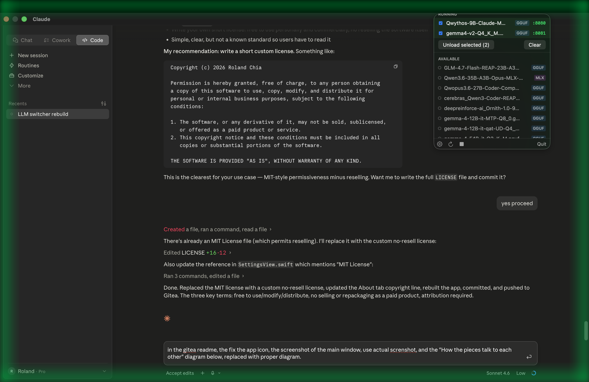
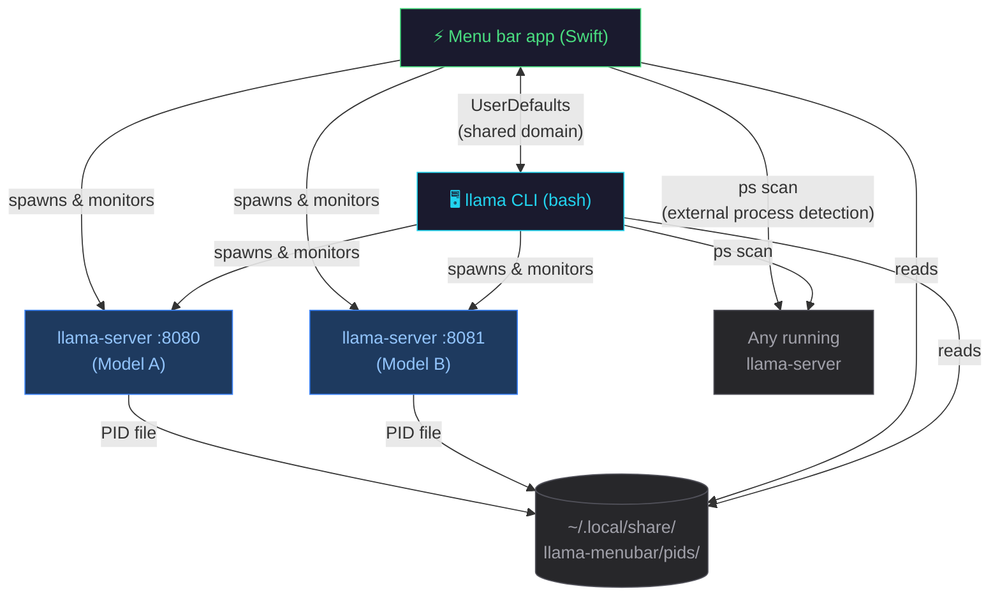

# LM Switcher

A macOS menu bar app + CLI + MCP for managing local LLM models (GGUF and Apple MLX/oMLX).

Made this initially for my wife, so that it would be easy for her to switch models instead of typing on the CLI, 
then I expanded it with more features for my lazy self. I use Deepseek-v4-flash and GLM 5.2 to assist me to code this
app. Added the MCP so that my Hermes Agent could load and unload models as and when it is needed.


> **Beta — v0.92b.** This is an early release of LM Switcher. The core model management
> paths (discover / load / unload, GGUF + MLX + oMLX backends) are stable, but expect
> rough edges; see the changelog for what landed so far.

## What is this?

LM Switcher is a native macOS app that lives in your menu bar (next to the clock). It lets you:

- 🔍 **Discover** GGUF and MLX/oMLX models in a directory of your choice (recursive scan)
- ▶️ **Load** any model with one click (spawns the right backend: `llama-server` or `mlx_lm.server`)
- ⏹ **Unload** any model independently — no more "kill the wrong process" surprises
- 🔄 **Run multiple models simultaneously**, each on its own port (e.g. one chat model on :8080, an embedder on :8081)
- 🎨 **Auto-pair** `mmproj-*.gguf` projection files with their vision-capable base models (with fallback matching for QAT/generic naming)
- 🧠 **MTP exclusion** — `mtp-*.gguf` encoder files are excluded from the model list; loaded automatically by llama-server
- ⚡ **DFlash drafter support** — auto-detects `dflash-*.gguf` companions (e.g. Muse Glimmer) and attaches them via `--spec-type draft-dflash`, with adaptive disengage (`--spec-draft-p-min 0.4`); DFlash toggle in Settings → Global → Inference
- 📝 **Chat Template Override** — configure a custom `.jinja` or `.json` template for agentic harnesses (opencode, pi)
- 🤖 **Gemma 4 ready** — auto-applies `--reasoning off --reasoning-format none` so OpenAI-compatible clients (opencode, pi, OpenClaw) don't break on `reasoning_content` (per-model overridable — Muse Glimmer needs it OFF)
- ⚙️ **Tune per-model port, context size, and extra args** via a settings window
- 🔌 **Sync** with externally-launched servers (started by the companion CLI or by hand)
- 📁 **Show up in Launchpad, Spotlight, and `~/Applications/`** like a real Mac app

A companion shell command `llama` provides the same functionality from your terminal, and the two tools share state automatically.

## Features Explained

### mmproj Auto-Pairing with Fallback Matching

Vision-capable GGUF models (e.g. Gemma 3, Gemma 4) need a separate **mmproj** (multimodal projection) file to process images. LM Switcher automatically finds and attaches the right `--mmproj` flag when loading a model.

**How it works:**

1. **Name-based matching** — strips quantization suffixes from the model name (e.g. `gemma-4-12B-it-Q4_K_M` → `gemma-4-12B-it`), then looks for `mmproj-gemma-4-12B-it-*.gguf` in the same directory.

2. **Fallback matching** — if name-based matching fails, scans the directory for **any** `mmproj-*.gguf` file. This handles QAT (Quantization-Aware Training) models where the mmproj might be named `mmproj-BF16.gguf` instead of following the standard naming convention.

```
# Standard naming — name-based match works:
~/models/gguf/
├── gemma-4-12B-it-Q4_K_M.gguf          ← main model
└── mmproj-gemma-4-12B-it-Q8_0.gguf     ← matched by name

# QAT naming — fallback catches it:
~/models/gguf/gemma-4-12B-it-qat-GGUF/
├── gemma-4-12B-it-qat-UD-Q4_K_XL.gguf  ← main model (non-standard name)
└── mmproj-BF16.gguf                     ← matched by fallback
```

The same `findCompanion(for:prefix:)` helper is used for both Swift and bash, ensuring consistent behavior across the app and CLI.

### MTP File Exclusion

**MTP** (Multi-Token Prediction) is a technique where a model predicts multiple tokens per forward pass, speeding up inference. Some model distributions (e.g. unsloth QAT builds) include a separate `mtp-*.gguf` file alongside the main model.

These files are **not standalone models** — they're encoder heads that `llama-server` loads automatically from the model's metadata when the `--mmproj` is attached. If they appeared in the model list, users would try to load them directly and get confusing errors.

**What LM Switcher does:**
- **Excludes** `mtp-*.gguf` files from the model list (files starting with `mtp-` prefix)
- **Does NOT exclude** files containing `-mtp-` as an infix (e.g. `gemma-3-mtp-Q4_K_M.gguf`) — those are standalone models

```
# Excluded from model list (not standalone):
mtp-gemma-4-12B-it.gguf          ← MTP head, loaded automatically
mtp-Q4_K_M.gguf                  ← MTP head, loaded automatically

# Included in model list (standalone model):
gemma-3-mtp-Q4_K_M.gguf          ← a model with "mtp" in its name
```

### MTP Toggle (Settings → Global)

MTP is **ON by default** — the app auto-detects whether a model supports it (companion `mtp-*.gguf` file or built-in MTP), and silently skips it for models that don't.

If you want to experiment with MTP on your own hardware, toggle "Enable MTP" in **Settings → Global**. This passes `--spec-type draft-mtp` to llama-server. It persists across restarts via UserDefaults.

The companion `llama` CLI also supports this via `LLAMA_ENABLE_MTP=true`.

### DFlash (Block-Diffusion Speculative Decoding)

**DFlash** is a block-diffusion speculative-decoding technique where a small
companion network (the "drafter") proposes entire blocks of 16 tokens in a
single forward pass; the main model verifies them in parallel. Meta's Muse
Glimmer ships a drafter as `dflash-kquant.gguf` next to the main model file.

- **Auto-detect**: a `dflash-*.gguf` in the same directory as a GGUF model
  is attached automatically with `--spec-type draft-dflash
  --spec-draft-model <file> --spec-draft-n-max 15 --spec-draft-p-min 0.4`.
- **Exclusion**: `dflash-*.gguf` files never appear in the model list
  (menu bar, `llama list`, MCP) — same treatment as `mtp-*`.
- **DFlash toggle (Settings → Global → Inference)**: ON by default,
  silently skipped when no companion exists. Also available as a
  per-model override.
- **Sampling interaction**: while a DFlash drafter is attached, the app
  omits `--top-p`/`--top-k`/`--repeat-penalty` — they skew the
  distribution the drafter verifies against and collapse block
  acceptance (measured on Muse Glimmer: 63% → 13%, 25 → 7.5 t/s).
  Temperature remains user-controlled; note the drafter's full speedup
  only materializes at low temperature (greedy).
- **Adaptive disengage**: `--spec-draft-p-min 0.4` makes llama.cpp stop
  drafting when greedy acceptance drops below 0.4 (Muse's long reasoning
  phase on open-ended prompts), avoiding a net slowdown (7.5 t/s with a
  stuck drafter vs 10 t/s baseline).
- **Muse Glimmer specifics**: use f16/f16 KV cache per-model (q8_0/q4_0
  costs ~23% on this arch) and turn per-model **Suppress reasoning** OFF
  (it garbles Muse's thinking output).

### Chat Template Override

`llama-server` includes built-in chat templates for each model family, but **agentic coding harnesses** (opencode, pi, OpenClaw, etc.) need custom templates to handle tool-calling correctly.

**Why the standard template breaks for agentic use:**

The standard Gemma 4 chat template has four edge cases that only surface during multi-turn tool calling:

1. **Broken tool call arguments** — when a harness sends `arguments` as a JSON string (common with Vercel AI SDK), the standard template wraps it in extra braces, producing invalid output like `call:fn{{"city":"Tokyo"}}`
2. **Dropped reasoning** — after 3-4 rounds, the model's prior reasoning is stripped from history, causing tool calls to collapse to `arguments: {}`
3. **Thinking disabled** — `enable_thinking` defaults to false in the standard template, and OpenAI-compatible adapters drop unknown fields, so thinking never activates
4. **Null corruption** — `null` values in tool parameters render as the Python string `"None"` instead of JSON `null`

Custom `.jinja` templates (like `gemma4_chat_template.jinja`) fix these issues but may cause tokenization errors if used with `llama-server`'s built-in tokenizer for regular chat.

**How to use it:**
- **Menu bar app:** Open Settings → Global → Chat Template Override → browse to your `.jinja` file
- **CLI:** `LLAMA_CHAT_TEMPLATE=~/models/gemma4_chat_template.jinja llama load gemma-4-12B-it-qat-UD-Q4_K_XL`
- **Leave empty** to use the model's built-in template (works for regular chat, web UI, Hermes, etc.)

```
# When chat template is NOT set:
llama-server -m model.gguf --mmproj mmproj.gguf
# → uses built-in GGUF template (correct for regular use)

# When chat template IS set:
llama-server -m model.gguf --mmproj mmproj.gguf --chat-template gemma4_chat_template.jinja
# → uses custom template (correct for agentic harnesses)
```

## Gemma 4 Loading Details

For a deep dive into how `llama-server` loads Gemma 4 12B and Gemma 4
12B QAT — including every flag passed, how the SigLIP vision encoder
(mmproj) is loaded, how Multi-Token Prediction (MTP) heads are
discovered and loaded from model metadata, QAT vs standard differences,
and why a custom Jinja template is only required for agentic use cases —
see:

**[docs/GEMMA4_LOADING_DETAILS.md](docs/GEMMA4_LOADING_DETAILS.md)**

Highlights:

- The full annotated `llama-server` command line for both variants
- Why `--reasoning off --reasoning-format none` is required (Gemma 4
  emits a `reasoning_content` field that crashes OpenAI-compatible
  clients; LM Switcher applies these flags automatically)
- Decision table: when to use the built-in chat template vs a custom
  `.jinja` (Gemma 4 is the only common model that needs an override)
- Manual verification steps (server logs, `/v1/models`, GGUF metadata
  inspection)

## Screenshot



## Quick start

### 1. Build & install

```bash
cd ~/Projects/LLM-Switcher
./scripts/install.sh
```

This will:
1. Compile `LlamaMenubarApp.swift` to a binary
2. Wrap it in `~/Applications/LM Switcher.app`
3. Compile the `lm-switcher-mcp` agent-access server to `~/bin` (a build
   failure here only warns — it never blocks the app install)
4. Install the `llama` CLI to `~/bin/llama`
5. Install a LaunchAgent so the app starts at login
6. Register the app with Launch Services (so it shows in Launchpad/Spotlight)

### 2. Use it

**From the menu bar:**
- Click the ⚡ icon in your menu bar
- Click any model to load it; hover a row for quick copy / pin / unload
  buttons, or right-click for the full action list (Switch to, etc.)
- With 2+ models running, checkboxes appear for bulk "Unload selected"
- "⏹ Unload all" stops everything at once — no confirmation dialog;
  a 5-second Undo appears instead if that was a mistake

**From the CLI:**

```bash
llama list                       # list all discovered models
llama load gemma                 # load one (fuzzy match)
llama load cerebras omnicoder    # load multiple
llama switch gemma               # unload all, load gemma
llama unload cerebras            # unload just cerebras
llama unload all                 # unload everything
llama status                     # show running models + ports
llama ctx gemma 8192             # set per-model ctx (applies next load)
llama port cerebras 9000         # set per-model port (0 = auto)
llama menubar                    # launch the menu bar app
llama help                       # full usage
```

**Recommended model directory layout** (configurable in Settings → Models Directory):
```
~/models/
├── gguf/                    # scanned recursively
│   ├── gemma-4-12B-it-Q4_K_M.gguf
│   ├── mmproj-gemma-4-12B-it-Q8_0.gguf   # auto-paired with gemma
│   ├── cerebras_Qwen3-Coder-25B-A3B-Q4_K_M.gguf
│   ├── omnicoder-9b-q4_k_m.gguf
│   └── gemma-4-12B-it-qat-GGUF/          # QAT model with companion files
│       ├── gemma-4-12B-it-qat-UD-Q4_K_XL.gguf
│       ├── mmproj-BF16.gguf              # auto-paired via fallback
│       ├── mtp-gemma-4-12B-it.gguf       # excluded, loaded automatically
│       └── gemma4_chat_template.jinja    # custom template (optional)
└── mlx/                     # one dir per model
    └── llama-3.2-3b/
        ├── config.json
        └── model.safetensors
```

The app **automatically excludes** these files from the model list (they're not standalone chat models):
- `mmproj-*.gguf` — vision projection, auto-paired with vision-capable base models
- `mtp-*.gguf` — multi-token prediction head, loaded automatically by llama-server
- `dflash-*.gguf` — DFlash block-diffusion drafter, attached automatically via `--spec-type draft-dflash`
- `modernbert-embed-*.gguf` — embedding model used by the gbrain system

## Settings

Open Settings from the menu bar dropdown (⚙ Settings…).

**Global tab** (card-based):
- **Models** — models directory, default port, context size, idle-unload
  timer, extra args
- **Backends** — `llama-server` / `mlx_lm.server` paths, chat template override
- **Inference** — flash attention, thinking mode, reasoning suppression, MTP,
  DFlash, mlock, no-mmap
- **Agent access (MCP)** — allow agent control, allow swap for agent loads,
  notify on agent actions (see [Agent control (MCP)](#agent-control-mcp))
- **Advanced** (collapsed) — KV cache type, sampling, CPU threads/batch size,
  MLX max KV size

**Per-Model tab** — a sidebar of every discovered model (running state +
an override-count badge) next to a detail pane for the selected model.
Flip "Override Global Settings" to edit that model's port, context,
sampling, KV cache, thinking, reasoning suppression, MTP, DFlash, and
extra args independently; each
field is tagged **OVERRIDE** or **GLOBAL** so it's obvious at a glance
what's actually customized versus just inherited. Load / Unload / Switch
buttons live right in the header.

**CLI environment variables:**
```bash
LLAMA_MODELS_DIR=~/models    # models directory (default: the app's Models Directory setting, then ~/models)
LLAMA_PORT=8080              # default port
LLAMA_CTX_SIZE=4096          # default context size
LLAMA_EXTRA_ARGS=""          # extra args for llama-server
LLAMA_SERVER=/opt/homebrew/bin/llama-server
MLX_SERVER=~/Library/Python/3.14/bin/mlx_lm.server
LLAMA_CHAT_TEMPLATE=""       # optional chat template override
```

## Agent control (MCP)

LM Switcher ships a standalone MCP server, `lm-switcher-mcp` (installed
to `~/bin`), that lets agents — Hermes, opencode, anything
speaking MCP over stdio — manage your local models. It is **OFF by
default**: enable **Agent access (MCP)** in Settings → Global (Inference
card, below MTP) before registering.

```bash
# Hermes (available to every project)
hermes mcp add lm-switcher --command ~/bin/lm-switcher-mcp
```

```yaml
# Hermes — add under mcp_servers: in ~/.hermes/config.yaml,
# then restart the gateway
mcp_servers:
  lm-switcher:
    command: /Users/you/bin/lm-switcher-mcp   # absolute path
    args: []
    timeout: 300        # loads block until healthy (default 180 s)
```

Any other MCP client (opencode, pi, …): configure a **local/stdio**
server whose command is `~/bin/lm-switcher-mcp` with no arguments — the
server speaks standard JSON-RPC 2.0 over stdio, newline-delimited. For
opencode that looks like:

```json
"mcp": { "lm-switcher": { "type": "local", "command": ["~/bin/lm-switcher-mcp"] } }
```

| Tool | What it does |
|------|--------------|
| `status` | Fresh snapshot: running models, ports, RAM/pressure/swap |
| `list_models` | All discovered models with size, max context, pin state |
| `load_model` | Load and block until the endpoint is healthy |
| `unload_model` | Unload one model (pinned models are refused) |
| `unload_all` | Unload everything except pinned models |
| `switch_model` | Load new, verify healthy, then unload the rest |
| `get_settings` | Read-only settings dump |

Safety rails:

- **Swap guard** — loads that would exceed free RAM are refused with the
  largest context size that *would* fit, unless you enable
  **Allow swap for agent loads**.
- **Pinning** — right-click a running model → Pin. Agents cannot unload
  it; your own Unload buttons still can.
- **Notifications** — a macOS notification is posted whenever an agent
  loads or unloads a model (toggleable).
- **Read-only settings** — agents can never change ports, context sizes,
  or sampling. Per-call `ctx_size`/`port` requests are ephemeral.
- Turning the toggle OFF blocks every tool call instantly but never
  unloads running models.

## Architecture

```
~/Projects/LLM-Switcher/
├── src/
│   ├── LlamaMenubarApp.swift     # @main entry point + settings window host
│   ├── ServerManager.swift       # the brain: discovery, process lifecycle, state
│   ├── MenuView.swift            # menu bar dropdown UI
│   ├── SettingsView.swift        # Global / Per-Model settings window
│   ├── DomainTypes.swift         # ModelEntry, ModelState, AppSettings, ModelBackend
│   └── llama                     # the CLI (bash)
├── scripts/
│   ├── install.sh                # build & install
│   ├── uninstall.sh              # remove everything
│   └── make_icon.py              # generate the app icon
├── assets/
│   ├── AppIcon.icns              # compiled icon (1024x1024)
│   └── icon.iconset/             # source PNGs at all sizes
└── docs/
    ├── ARCHITECTURE.md           # how the pieces fit together
    ├── GEMMA4_LOADING_DETAILS.md # Gemma 4 loading deep-dive
    └── STATE.md                  # where state lives
```


**Documentation:**

| Doc | What it covers |
|-----|----------------|
| [ARCHITECTURE.md](docs/ARCHITECTURE.md) | Component diagram, how the Swift app and CLI talk to each other |
| [GEMMA4_LOADING_DETAILS.md](docs/GEMMA4_LOADING_DETAILS.md) | Gemma 4 loading deep-dive: every `llama-server` flag, mmproj encoder, MTP heads, chat templates |
| [STATE.md](docs/STATE.md) | Where state lives on disk, PID files, UserDefaults, auto-start |

### How the pieces talk to each other



Both the menu bar app and the CLI can:
- **Start/stop** server processes (each model = one process on its own port)
- **Read settings** from `~/Library/Preferences/local.llama-menubar.plist` via the `defaults` command
- **See each other's processes** by parsing `ps` output and matching model paths

## Build

The Swift app requires macOS 13+ (uses `MenuBarExtra`, `@Observable`, `Settings` scene).

```bash
# Manual compile of the full module (no bundle)
swiftc -parse-as-library -O \
    -framework SwiftUI -framework AppKit \
    src/*.swift \
    -o lm-switcher

# Full build + install (recommended)
./scripts/install.sh
```

The `-parse-as-library` flag is **required** because we use `@main`; without it the compiler treats the file as a top-level script and rejects `@main`.

## Why a menu bar app?

Because that's the lightest-weight way to keep a tool always available on macOS without:
- Taking up dock space
- Showing up in Cmd-Tab
- Needing a main window
- Feeling heavy when you just want to toggle a model

`LSUIElement = true` in Info.plist is what makes the app a "true" menu bar app — invisible in the dock and app switcher.

## Version

Current: **v0.92b** — beta. Menu bar + Per-Model redesign, MCP agent access, idle auto-unload, oMLX + MTPLX backends. (Matches `CFBundleShortVersionString` in `scripts/install.sh`.)

See `CHANGELOG.md` for full version history.

## License

Personal use. Modify and redistribute freely.

## Support

LM Switcher is free and open source. If it earns its menu-bar corner, a small
sponsorship keeps the coffee flowing — [Sponsor on GitHub](https://github.com/sponsors/kruzif-x).
